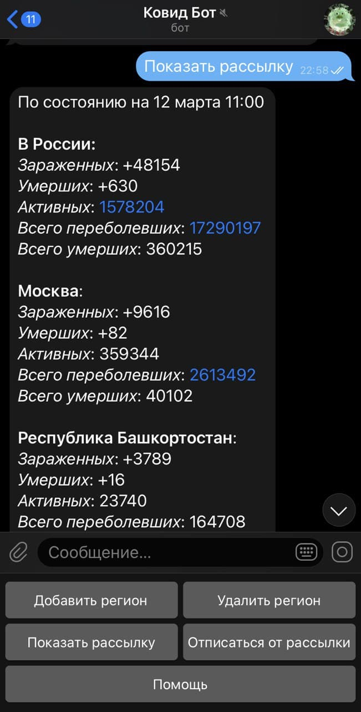

# COVID19-STATISTIC-BOT

<br>Всем привет!</br>
Это телеграм-бот, который собирает даннные по заболеваемости коронавирусом в субъектах РФ и генерирует статистику для ежедневной рассылки.

## Порядок работы с ботом:
1. Добавить регионы в подписки
2. Автоматическая рассылка по подпискам

## Функционал бота:
<br><b>/start</b> - регистрация пользователя в системе</br>
<br><b>Добавить регион</b> - добавить регион в подписки</br>
<br><b>Удалить регион</b> - удалить регион из подписок</br>
<br><b>Показать рассылку</b> - показать сгенерированную статистику для рассылки</br>
<br><b>Отписаться от рассылки</b> - удалить пользователя со всеми подписками</br>
<br><b>Помощь</b> - информация по работе с ботом</br>
<br><b>/regions</b> - список субъектов РФ, по которым проводится выборка</br>

## Автосборка
Осуществляется через Heroku по коммиту

## Описание сервисов:
### ExtractorService

Собирает данные с официального сайта [стопкоронавирус.рф](https://стопкоронавирус.рф), сохраняет в БД и отправляет пользователю рассылку

Параметр периодичности: 
```
    -extractor.period = 0 0 12 * * * // обновление в 12:00 по мск, каждый день;
```

### [CRON-JOB.org](https://cron-job.org/)

Во избежание засыпания dyno с бесплатным тарифным планом, пингует приложение по адресу https://covid19-statistic-bot.herokuapp.com/

Параметр периодичности: 
```
  -0 0/30 * * * * // каждые 30 минут;
```




